Analysis of Casco Bay OA data through 2018 – Tidal Patterns
================
Curtis C. Bohlen, Casco Bay Estuary Partnership

-   [Introduction](#introduction)
-   [Load Libraries](#load-libraries)
-   [Color Palette](#color-palette)
-   [Load Data](#load-data)
    -   [Establish Folder References](#establish-folder-references)
    -   [Read Data](#read-data)
-   [Prepare Tidal Data](#prepare-tidal-data)
    -   [Read Tides Data](#read-tides-data)
        -   [Data Correction](#data-correction)
    -   [Tidal Amplitudes Data](#tidal-amplitudes-data)
        -   [Daily Tidal Amplitudes](#daily-tidal-amplitudes)
        -   [Medians of Observational
            Data](#medians-of-observational-data)
    -   [Time Since High Tide Data](#time-since-high-tide-data)
        -   [Deviations From Average Within a Tidal
            Cycle](#deviations-from-average-within-a-tidal-cycle)
    -   [Cleanup](#cleanup)
-   [Analysis of Time Since High
    Tide](#analysis-of-time-since-high-tide)
    -   [PCO<sub>2</sub> Analysis](#pco2-analysis)
        -   [Initial Graphic](#initial-graphic)
        -   [GAM Model](#gam-model)
        -   [GAMM with Autocorrelation](#gamm-with-autocorrelation)
        -   [Generate Predictions from GAMM
            Model](#generate-predictions-from-gamm-model)
        -   [Create Ribbon Graphic](#create-ribbon-graphic)
    -   [pH Analyses](#ph-analyses)
        -   [Initial Graphic](#initial-graphic-1)
        -   [GAM Model](#gam-model-1)
        -   [GAMM with Autocorrelation](#gamm-with-autocorrelation-1)
        -   [Generate Predictions from the
            Model](#generate-predictions-from-the-model)
        -   [Create Ribbon Graphic](#create-ribbon-graphic-1)
-   [Analysis of Spring Tide - Neap
    Cycles](#analysis-of-spring-tide---neap-cycles)
    -   [pCO<sub>2</sub> vs Tidal Amplitude](#pco2-vs-tidal-amplitude)
        -   [Graphic](#graphic)
        -   [An informal Look at
            Correlations](#an-informal-look-at-correlations)
        -   [Formal Analysis](#formal-analysis)
    -   [pH vs Tidal Amplitude](#ph-vs-tidal-amplitude)
        -   [Graphic](#graphic-1)
        -   [An informal Look at
            Correlations](#an-informal-look-at-correlations-1)
        -   [Formal Analysis](#formal-analysis-1)
    -   [Direct Comparison Graphics For
        2016](#direct-comparison-graphics-for-2016)
        -   [Using Daily Medians](#using-daily-medians)
        -   [Using All Observations](#using-all-observations)


# Introduction

This notebook and related notebooks document analysis of data derived
from a multi-year deployment of ocean acidification monitoring equipment
at the Southern Maine Community College pier, in South Portland, Maine.

The monitoring set up was designed and operated by Joe Kelly, of UNH and
his colleagues, on behalf of the Casco Bay Estuary Partnership. This was
one of the first long-term OA monitoring facilities in the northeast,
and was intended to test available technologies as well as gain
operational experience working with acidification monitoring.

In this Notebook, we develop analyses of tidal patterns, looking both at
patterns with the daily tides and with spring tide-neap tide cycles.

# Load Libraries

``` r
library(tidyverse)  # includes readr, readxl and lubridate
```

    ## -- Attaching packages --------------------------------------- tidyverse 1.3.1 --

    ## v ggplot2 3.3.5     v purrr   0.3.4
    ## v tibble  3.1.6     v dplyr   1.0.7
    ## v tidyr   1.1.4     v stringr 1.4.0
    ## v readr   2.1.1     v forcats 0.5.1

    ## -- Conflicts ------------------------------------------ tidyverse_conflicts() --
    ## x dplyr::filter() masks stats::filter()
    ## x dplyr::lag()    masks stats::lag()

``` r
library(lubridate)
```

    ## 
    ## Attaching package: 'lubridate'

    ## The following objects are masked from 'package:base':
    ## 
    ##     date, intersect, setdiff, union

``` r
library(mgcv)
```

    ## Loading required package: nlme

    ## 
    ## Attaching package: 'nlme'

    ## The following object is masked from 'package:dplyr':
    ## 
    ##     collapse

    ## This is mgcv 1.8-38. For overview type 'help("mgcv-package")'.

``` r
library(CBEPgraphics)
load_cbep_fonts()
theme_set(theme_cbep())
```

# Color Palette

For Seasonal Displays. This is just a list, not a function, like
cbep\_colors().

``` r
season_palette = c(cbep_colors()[1],
                    cbep_colors()[4],
                    cbep_colors()[2],
                    'orange')
```

# Load Data

## Establish Folder References

``` r
sibfldnm <- 'Data'
parent   <- dirname(getwd())
sibling  <- file.path(parent,sibfldnm)

fn    <- 'CascoBayOAData.csv'
fpath <- file.path(sibling,fn)
```

The following loads existing data, including a “temperature corrected”
pCO<sub>2</sub> value based on Takahashi et al. 2002. It then collapses
that data to daily summaries.

> Takahashi, Taro & Sutherland, Stewart & Sweeney, Colm & Poisson, Alain
> & Metzl, Nicolas & Tilbrook, Bronte & Bates, Nicholas & Wanninkhof,
> Rik & Feely, Richard & Chris, Sabine & Olafsson, Jon & Nojiri,
> Yukihiro. (2002). Global sea-air CO2 flux based on climatological
> surface ocean pCO<sub>2</sub>, and seasonal biological and temperature
> effects. Deep Sea Research Part II: Topical Studies in Oceanography.
> 49. 1601-1622. 10.1016/S0967-0645(02)00003-6.

## Read Data

We add the Month and Season factor here for use in later graphics.

Note that the original time coordinate here is in UTC, not local time.
But by default, `read_csv()` interprets times according to the locale,
here Eastern Standard Time or Eastern Daylight Time, depending on time
of year. I have not found an easy way to alter that behavior, but the
`force_tz()` function in `lubridate` can fix it. Once that happens, the
time is in UTC, and we can express it in for time zone by changing the
‘tzone’ attribute.

For analysis of the impact of tides, the main thing is to make sure that
both the tide data and the OA data use the SAME time coordinate. We use
Local Standard Time.

``` r
all_data <- read_csv(fpath,
                     col_types = cols(dd = col_integer(), 
                                      doy = col_integer(),
                                      hh = col_integer(),
                                      mm = col_integer(),
                                      yyyy = col_integer())) %>%
  mutate(datetime = force_tz(datetime, tzone = 'UTC')) %>%
  
  # Calculate local standard time coordinates
  mutate(stdtime = structure(datetime, tzone = 'Etc/GMT+5')) %>%
  mutate(yyyy  = as.numeric(format(stdtime, format = '%Y')),
         mm    = as.numeric(format(stdtime, format = '%m')),
         dd    = as.numeric(format(stdtime, format = '%d')),
         doy   = as.numeric(format(stdtime, format = '%j')),
         hh    = as.numeric(format(stdtime, format = '%H')),
         Month = factor(mm, levels=1:12, labels = month.abb)
         ) %>%
  mutate(Season = recode_factor(mm, 
                                `1`  = 'Winter',
                                `2`  = 'Winter',
                                `3`  = 'Spring',
                                `4`  = 'Spring',
                                `5`  = 'Spring',
                                `6`  = 'Summer',
                                `7`  = 'Summer',
                                `8`  = 'Summer',
                                `9`  = 'Fall',
                                `10` = 'Fall',
                                `11` = 'Fall',
                                `12` = 'Winter'
                                ))
```

# Prepare Tidal Data

## Read Tides Data

Here we are dealing with NOAA’s API. We downloaded the data in “local
standard time”, but we face the same problem we did importing temporal
data for time of day (above). The function read\_csv implicitly imports
time data in local clock time. We need to convert to Standard Time.

``` r
fn = 'portland_HiLo_tides.csv'
fpath <- file.path(sibling,fn)
tide_data <- read_csv(fpath, 
                       col_types =
                        cols(Date = col_skip(),
                             DateTime = col_datetime(format = "%Y-%m-%d %H:%M"), 
                             Time = col_skip())) %>%
  rename(stdtime = DateTime, wl = `Water Level`, type = Sigma) %>%
  mutate(stdtime = force_tz(stdtime, tzone = 'Etc/GMT+5'))
```

### Data Correction

The tide data downloaded from the NOAA API lacks tide entries for leap
day in 2016. Looking data up on the (NOAA page for the Portland Tide
Gage)\[<https://tidesandcurrents.noaa.gov/waterlevels.html?id=8418150&units=standard&bdate=20160229&edate=20160229&timezone=LST&datum=MLLW&interval=hl&action=>\]
for the Portland tide station, we find that High and low tides on that
day were (local standard time):

Level \| Time \| Elevation
\_\_\_\_\_\_\|\_\_\_\_\_\_\_\|\_\_\_\_\_\_\_\_\_\_ HH \| 03:00 \| 9.3 L
\| 09:24 \| 1.32 H \| 15:30 \| 8.48 LL \| 21:30 \| 1.15

We add those to the tides data by hand.

``` r
tide_data <- tide_data %>%
  add_row (stdtime = ISOdatetime(2016,2,29,3,0,0, tz = 'Etc/GMT+5'),
           wl = 9.3, type = 'HH', .after=1639) %>%
  add_row (stdtime = ISOdatetime(2016,2,29,9,24,0, tz = 'Etc/GMT+5'),
           wl = 1.32, type = 'L', .after=1640) %>%
  add_row (stdtime = ISOdatetime(2016,2,29,15,30,0, tz = 'Etc/GMT+5'),
           wl = 8.48, type = 'H', .after=1641) %>%
  add_row (stdtime = ISOdatetime(2016,2,29,21,30,0, tz = 'Etc/GMT+5'),
           wl = 1.15, type = 'LL', .after=1642)
```

## Tidal Amplitudes Data

### Daily Tidal Amplitudes

Next, we calculate the observed daily tidal range for each day in the
study period. We use this later to analyze the impact of tidal amplitude
on OA parameters.

``` r
amplitude_data <- tide_data %>%
  mutate(d = as.Date(stdtime)) %>%
  pivot_wider(names_from = type, values_from = wl) %>%
  select(-stdtime) %>%
  group_by(d) %>%
    summarise(hh = mean(HH, na.rm=TRUE),
              h  = mean(H, na.rm=TRUE),
              ll = mean(LL, na.rm=TRUE),
              l  = mean(L, na.rm=TRUE),
              .groups = 'drop') %>%
  mutate(range = ifelse(is.na(hh), h, hh) - ifelse(is.na(ll),l,ll)) %>%
  select(-c(hh,h,ll,l)) %>%
  mutate(yyyy = as.numeric(format(d, format = '%Y')),
         Month = factor(as.numeric(format(d, format = '%m')),
                        levels=1:12, labels = month.abb),
        Season = recode_factor(Month, 
                                Jan  = 'Winter',
                                Feb  = 'Winter',
                                Mar  = 'Spring',
                                Apr  = 'Spring',
                                May  = 'Spring',
                                Jun  = 'Summer',
                                Jul  = 'Summer',
                                Aug  = 'Summer',
                                Sep  = 'Fall',
                                Oct  = 'Fall',
                                Nov  = 'Fall',
                                Dec  = 'Winter'
                                )
         )
```

### Medians of Observational Data

We also need to calculate daily medians of the OA data parameters.

``` r
tmp <- all_data %>%
  mutate(d = as.Date(stdtime)) %>%
  group_by(d) %>%
  summarize_at(c('ph', 'co2', 'co2_corr', 'temp', 'sal', 'do'), function(x) median(x, na.rm = TRUE))

amplitude_data <- amplitude_data %>%
  left_join(tmp, by = 'd') %>%
  filter(! (is.na(ph) & is.na(co2) & is.na(co2_corr)))
rm(tmp)
```

## Time Since High Tide Data

We use a function provided in base R called `indInterval.`

You might think of `findInterval()` it as a function that assigns values
to values in the first list to bins defined by values in the second
list.

For our use, we put the list of all times in the first parameter, and
the list of ONLY high tides in the second parameter. The function will
figure out which interval (defined by values in the second list, our
high tides) each value in the first list belongs to. The function
returns a list of the INDEXES of the “closest but smaller” value in the
second list. We then use those indexes to look up the times associated
with those indexes, matching each observation with the time of the
previous high tide.

``` r
hightide_data <- tide_data %>%
  filter(type =='H' | type == 'HH')

tidal_data <- all_data %>%
  mutate(tideindex = findInterval(all_data$stdtime, hightide_data$stdtime)) %>%
  mutate(tideindex = ifelse(tideindex==0, NA, tideindex)) %>%
  
  mutate(tidetimes = hightide_data$stdtime[tideindex],
         hrssincehigh = as.integer(difftime(stdtime,tidetimes,units = 'hours')),
         minssincehigh = as.integer(difftime(stdtime,tidetimes,units = 'mins')))
```

### Deviations From Average Within a Tidal Cycle

Finally, we need to calculate how much each observation differs from the
average value of all observations that have occurred since the prior
high tide. We can do that based on the tide indexes too.

``` r
tidal_data <- tidal_data %>%
  group_by(tideindex) %>%
  
  # Calculate sample sizes for each tide
  mutate(co2_n      = sum(! is.na(co2)),
         co2_corr_n = sum(! is.na(co2_corr)),
         ph_n       = sum(! is.na(ph)),
         omega_n   = sum(! is.na(omega_c))) %>%
  
  # Calculate centered but not scaled values, tide by tide
  mutate(co2_res      = scale(co2, scale = FALSE),
         co2_corr_res = scale(co2_corr, scale = FALSE),
         ph_res       = scale(ph, scale = FALSE),
         omega_res    = scale(omega_c, scale = FALSE)) %>%
  ungroup(tideindex) %>%
  
  # Replace data from any tides with less than 8 hours of data with NA
  mutate(co2_res      = ifelse(co2_n>=8, co2_res, NA),
         co2_corr_res = ifelse(co2_corr_n>=8, co2_corr_res, NA),
         ph_res       = ifelse(ph_n>=8, ph_res, NA),
         omega_res    = ifelse(omega_n>=8, omega_res, NA)
         ) %>%
    
  # Remove the sample size variables
    select(-co2_n, -co2_corr_n, -ph_n, -omega_n)
```

## Cleanup

``` r
rm(all_data, hightide_data, tide_data)
```

# Analysis of Time Since High Tide

## PCO<sub>2</sub> Analysis

### Initial Graphic

We fit a simple model, that fits a GAM smoother (cyclic cubic spline) to
time since high tide, WITHOUT accounting for autocorrelation.

Note also that we do not include linear predictor main effects for the
seasons here. That is because we know, *a priori*, that the average
deviation from daily averages is zero, so there is no intercept term.

``` r
ggplot(tidal_data, aes(minssincehigh, co2_corr_res)) + 
  geom_point(alpha = 0.05, color = cbep_colors()[5]) +
  geom_smooth(mapping = aes(color = Season),
              method = 'gam', formula = y ~s(x, bs='cc'),
              se = FALSE) +
  
  theme_cbep(base_size= 12) +
  theme(legend.key.width = unit(0.25,"in"),
        legend.text      = element_text(size = 8)) +
  
  scale_x_continuous(breaks = c(0, 180, 360, 540, 720),
                     labels = c(0, 3, 6, 9, 12)) +
  
  scale_color_manual(values = season_palette, name = '') +
  geom_text(aes(x = 60, y = 200, label = 'Falling Tide'), hjust = 0) +
  geom_text(aes(x = 480, y = 200, label = 'Rising Tide'), hjust = 0) +
  
  xlab('Hours Since High Tide') +
  ylab(expression (atop(Corrected~pCO[2]~(mu*Atm), 
                        Difference~From~Tide~Cycle~Average))) 
```

    ## Warning: Removed 6265 rows containing non-finite values (stat_smooth).

    ## Warning: Removed 6265 rows containing missing values (geom_point).

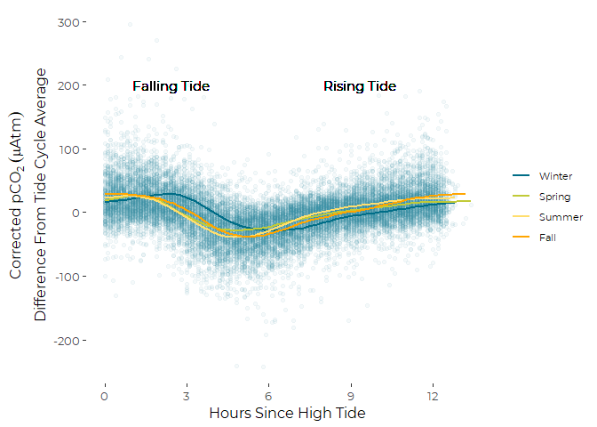<!-- -->

### GAM Model

``` r
system.time(pco2_gam <- gam(co2_corr_res ~  s(minssincehigh, by = Season, bs='cc'),
                 data = tidal_data))
```

    ##    user  system elapsed 
    ##    0.14    0.02    0.15

``` r
summary(pco2_gam)
```

    ## 
    ## Family: gaussian 
    ## Link function: identity 
    ## 
    ## Formula:
    ## co2_corr_res ~ s(minssincehigh, by = Season, bs = "cc")
    ## 
    ## Parametric coefficients:
    ##             Estimate Std. Error t value Pr(>|t|)
    ## (Intercept) -0.00147    0.22368  -0.007    0.995
    ## 
    ## Approximate significance of smooth terms:
    ##                                 edf Ref.df     F p-value    
    ## s(minssincehigh):SeasonWinter 7.047      8 130.4  <2e-16 ***
    ## s(minssincehigh):SeasonSpring 7.160      8 114.7  <2e-16 ***
    ## s(minssincehigh):SeasonSummer 7.262      8 375.9  <2e-16 ***
    ## s(minssincehigh):SeasonFall   7.175      8 470.9  <2e-16 ***
    ## ---
    ## Signif. codes:  0 '***' 0.001 '**' 0.01 '*' 0.05 '.' 0.1 ' ' 1
    ## 
    ## R-sq.(adj) =  0.322   Deviance explained = 32.3%
    ## GCV = 923.04  Scale est. = 921.55    n = 18420

``` r
oldpar <- par(mfrow= c(2,2))
gam.check(pco2_gam)
```

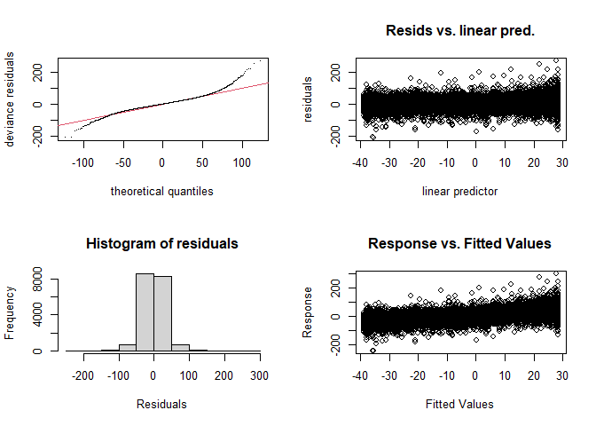<!-- -->

    ## 
    ## Method: GCV   Optimizer: magic
    ## Smoothing parameter selection converged after 7 iterations.
    ## The RMS GCV score gradient at convergence was 0.0005756281 .
    ## The Hessian was positive definite.
    ## Model rank =  33 / 33 
    ## 
    ## Basis dimension (k) checking results. Low p-value (k-index<1) may
    ## indicate that k is too low, especially if edf is close to k'.
    ## 
    ##                                 k'  edf k-index p-value
    ## s(minssincehigh):SeasonWinter 8.00 7.05    0.99    0.26
    ## s(minssincehigh):SeasonSpring 8.00 7.16    0.99    0.20
    ## s(minssincehigh):SeasonSummer 8.00 7.26    0.99    0.22
    ## s(minssincehigh):SeasonFall   8.00 7.17    0.99    0.22

``` r
par(oldpar)
rm(oldpar)
```

Other than extremely heavy tails, I see nothing here that suggests any
major pathologies to this model. The heavy tails are expected with high
temporal autocorrelation.

#### Autocorrelation

``` r
pacf(resid(pco2_gam))
```

<!-- -->

We have significant autocorrelation, on the order of phi = 0.6.

``` r
rm(pco2_gam)
```

### GAMM with Autocorrelation

This took about 20 minutes to run.

``` r
# we run out of memory if we don't use a grouping
system.time(pco2_gamm <- gamm(co2_corr_res ~  s(minssincehigh, by = Season, 
                                               bs='cc', k=6),
                 correlation = corAR1(form = ~ 1 | Season),  
                 data = tidal_data))
```

    ##    user  system elapsed 
    ##  480.44  138.22  618.97

``` r
summary(pco2_gamm$gam)
```

    ## 
    ## Family: gaussian 
    ## Link function: identity 
    ## 
    ## Formula:
    ## co2_corr_res ~ s(minssincehigh, by = Season, bs = "cc", k = 6)
    ## 
    ## Parametric coefficients:
    ##             Estimate Std. Error t value Pr(>|t|)
    ## (Intercept) -0.00132    0.46628  -0.003    0.998
    ## 
    ## Approximate significance of smooth terms:
    ##                                 edf Ref.df     F p-value    
    ## s(minssincehigh):SeasonWinter 3.963      4 150.5  <2e-16 ***
    ## s(minssincehigh):SeasonSpring 3.947      4 123.5  <2e-16 ***
    ## s(minssincehigh):SeasonSummer 3.985      4 421.2  <2e-16 ***
    ## s(minssincehigh):SeasonFall   3.985      4 507.6  <2e-16 ***
    ## ---
    ## Signif. codes:  0 '***' 0.001 '**' 0.01 '*' 0.05 '.' 0.1 ' ' 1
    ## 
    ## R-sq.(adj) =  0.317   
    ##   Scale est. = 928.34    n = 18420

### Generate Predictions from GAMM Model

``` r
newdat <- expand.grid(minssincehigh = seq(0, 12.5*60),
                    Season = c('Winter', 'Spring', 'Summer', 'Fall'))
p <- predict(pco2_gamm$gam, newdata = newdat, se.fit=TRUE)
newdat <- newdat %>%
  mutate(pred = p$fit, se = p$se.fit)
```

### Create Ribbon Graphic

The ribbon plot shows approximate 95% confidence intervals for the GAMM
fits by season.

``` r
ggplot(newdat, aes(x=minssincehigh, y=pred, color = Season)) + #geom_line() +
  geom_ribbon(aes(ymin = pred-(1.96*se),
                  ymax = pred+(1.96*se),
                  fill = Season), alpha = 0.5,
              color = NA) +
  
  theme_cbep(base_size= 12) +
  theme(legend.key.width = unit(0.25,"in"),
        legend.text      = element_text(size = 8)) +
  
  scale_x_continuous(breaks = c(0, 180, 360, 540, 720),
                     labels = c(0, 3, 6, 9, 12)) +
  
  scale_fill_manual(values = season_palette, name = '') +
  
  xlab('Hours since High Tide') +
  ylab(expression (atop(Corrected~pCO[2]~(mu*Atm), 
                        Difference~From~Tide~Cycle~Average)))
```

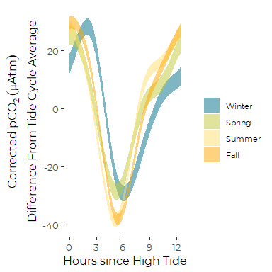<!-- -->

## pH Analyses

### Initial Graphic

We fit a simple model, that fits a GAM smoother (cyclic cubic spline) to
time since high tide WITHOUT accounting for autocorrelation.

``` r
ggplot(tidal_data, aes(minssincehigh, ph_res)) + 
  geom_point(alpha = 0.05, color = cbep_colors()[5]) +
  geom_smooth(mapping = aes(color = Season),
              method = 'gam', formula = y ~s(x, bs='cc'),
              se = FALSE) +
  
  theme_cbep(base_size= 12) +
  theme(legend.key.width = unit(0.25,"in"),
        legend.text      = element_text(size = 8)) +
  
  scale_x_continuous(breaks = c(0, 180, 360, 540, 720),
                     labels = c(0, 3, 6, 9, 12)) +
  
  scale_color_manual(values = season_palette, name = '') +
  geom_text(aes(x = 60, y = 0.15, label = 'Falling Tide'), hjust = 0) +
  geom_text(aes(x = 480, y = 0.15, label = 'Rising Tide'), hjust = 0) +
  
  xlab('Hours Since High Tide') +
  ylab(expression (atop(pH, Difference~From~Tide~Cycle~Average))) 
```

    ## Warning: Removed 11902 rows containing non-finite values (stat_smooth).

    ## Warning: Removed 11902 rows containing missing values (geom_point).

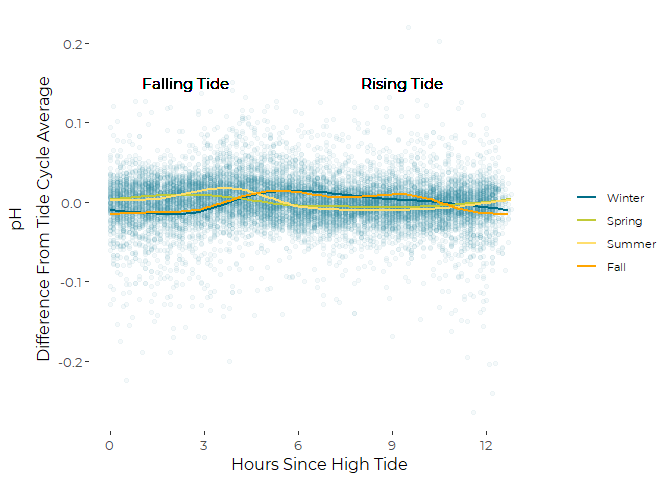<!-- -->

Visually, the pattern is far less clear here than for pCO<sub>2</sub>.
As the modeling will show, there’s likely little real pattern here.

### GAM Model

``` r
system.time(ph_gam <- gam(ph_res ~  s(minssincehigh, by = Season, bs='cc'),
                 data = tidal_data))
```

    ##    user  system elapsed 
    ##    0.08    0.00    0.08

``` r
summary(ph_gam)
```

    ## 
    ## Family: gaussian 
    ## Link function: identity 
    ## 
    ## Formula:
    ## ph_res ~ s(minssincehigh, by = Season, bs = "cc")
    ## 
    ## Parametric coefficients:
    ##               Estimate Std. Error t value Pr(>|t|)
    ## (Intercept) -8.713e-07  2.476e-04  -0.004    0.997
    ## 
    ## Approximate significance of smooth terms:
    ##                                 edf Ref.df      F p-value    
    ## s(minssincehigh):SeasonWinter 4.244      8 14.175  <2e-16 ***
    ## s(minssincehigh):SeasonSpring 3.053      8  8.429  <2e-16 ***
    ## s(minssincehigh):SeasonSummer 6.965      8 79.212  <2e-16 ***
    ## s(minssincehigh):SeasonFall   7.085      8 72.837  <2e-16 ***
    ## ---
    ## Signif. codes:  0 '***' 0.001 '**' 0.01 '*' 0.05 '.' 0.1 ' ' 1
    ## 
    ## R-sq.(adj) =  0.0988   Deviance explained =   10%
    ## GCV = 0.00078488  Scale est. = 0.00078351  n = 12783

All four seasonal patterns are judged unlikely to be due solely to
chance, but we have not yet considered autocorrelation between
successive observations.

``` r
gam.check(ph_gam)
```

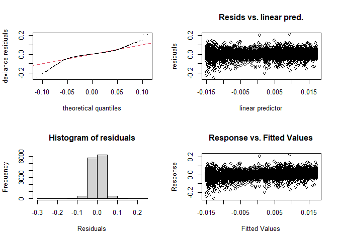<!-- -->

    ## 
    ## Method: GCV   Optimizer: magic
    ## Smoothing parameter selection converged after 4 iterations.
    ## The RMS GCV score gradient at convergence was 2.427251e-08 .
    ## The Hessian was positive definite.
    ## Model rank =  33 / 33 
    ## 
    ## Basis dimension (k) checking results. Low p-value (k-index<1) may
    ## indicate that k is too low, especially if edf is close to k'.
    ## 
    ##                                 k'  edf k-index p-value
    ## s(minssincehigh):SeasonWinter 8.00 4.24    0.99    0.21
    ## s(minssincehigh):SeasonSpring 8.00 3.05    0.99    0.16
    ## s(minssincehigh):SeasonSummer 8.00 6.97    0.99    0.26
    ## s(minssincehigh):SeasonFall   8.00 7.08    0.99    0.19

Other than heavy tails, I see nothing here that suggests any major
pathologies to this model. The heavy tails are expected with high
temporal autocorrelation.

#### Autocorrelation

``` r
pacf(resid(ph_gam))
```

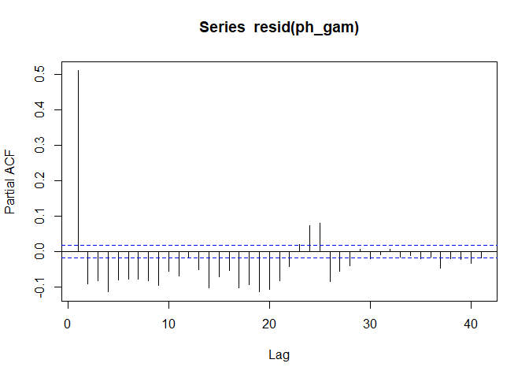<!-- -->

We have significant autocorrelation, on the order of phi = 0.5.

### GAMM with Autocorrelation

This took about 7 minutes.

``` r
# we run out of memory if we don't use a grouping
system.time(ph_gam <- gamm(ph_res ~  s(minssincehigh, by = Season, bs='cc', k=6),
                 correlation = corAR1(form = ~ 1 | Season), 
                 data = tidal_data))
```

    ##    user  system elapsed 
    ##  184.57   42.55  227.20

``` r
summary(ph_gam$gam)
```

    ## 
    ## Family: gaussian 
    ## Link function: identity 
    ## 
    ## Formula:
    ## ph_res ~ s(minssincehigh, by = Season, bs = "cc", k = 6)
    ## 
    ## Parametric coefficients:
    ##               Estimate Std. Error t value Pr(>|t|)
    ## (Intercept) -0.0000052  0.0004339  -0.012     0.99
    ## 
    ## Approximate significance of smooth terms:
    ##                                 edf Ref.df      F p-value    
    ## s(minssincehigh):SeasonWinter 3.572      4 15.898  <2e-16 ***
    ## s(minssincehigh):SeasonSpring 3.065      4  8.969  <2e-16 ***
    ## s(minssincehigh):SeasonSummer 3.852      4 76.223  <2e-16 ***
    ## s(minssincehigh):SeasonFall   3.869      4 68.693  <2e-16 ***
    ## ---
    ## Signif. codes:  0 '***' 0.001 '**' 0.01 '*' 0.05 '.' 0.1 ' ' 1
    ## 
    ## R-sq.(adj) =  0.0921   
    ##   Scale est. = 0.00078967  n = 12783

So we see clear diurnal patterns

### Generate Predictions from the Model

``` r
newdat <- expand.grid(minssincehigh = seq(0, 12.5*60),
                    Season = c('Winter', 'Spring', 'Summer', 'Fall'))
p <- predict(ph_gam$gam, newdata = newdat, se.fit=TRUE)
newdat <- newdat %>%
  mutate(pred = p$fit, se = p$se.fit)
```

### Create Ribbon Graphic

The ribbon plot shows approximate 95% confidence intervals for the GAMM
fits by season.

``` r
ggplot(newdat, aes(x=minssincehigh, y=pred, color = Season)) +
  geom_ribbon(aes(ymin = pred-(1.96*se),
                  ymax = pred+(1.96*se),
                  fill = Season), alpha = 0.5,
              color = NA) +
  
  theme_cbep(base_size= 12) +
  theme(legend.key.width = unit(0.25,"in"),
        legend.text      = element_text(size = 8)) +
  
  scale_x_continuous(breaks = c(0, 180, 360, 540, 720),
                     labels = c(0, 3, 6, 9, 12)) +
  
  scale_fill_manual(values = season_palette, name = '') +
  
  xlab('Hours since High Tide') +
  ylab(expression (atop(pH, Difference~From~Tide~Cycle~Average)))
```

<!-- -->

# Analysis of Spring Tide - Neap Cycles

A utility function for quickly looking at three different types of
correlation coefficients.

``` r
threecors <- function(x,y = NULL) {
  res = list(Pearson = '', Spearman = '', Kendall = '')
  res[['Pearson']]  <- cor(x,y, use = 'pairwise', method = 'pearson')
  res[['Spearman']] <- cor(x,y, use = 'pairwise', method = 'spearman')
  res[['Kendall']]   <- cor(x,y, use = 'pairwise', method = 'kendall')
unlist(res)
}

threecors(1:10, 10:1)
```

    ##  Pearson Spearman  Kendall 
    ##       -1       -1       -1

## pCO<sub>2</sub> vs Tidal Amplitude

### Graphic

``` r
ggplot(amplitude_data, aes(range, co2_corr)) +
  geom_point(aes(color = Season)) +
  geom_smooth(mapping =aes(color = Season), method = 'lm', se = FALSE) +


  theme(legend.key.width = unit(0.25,"in"),
        legend.text      = element_text(size = 8)) +
  
  scale_x_continuous(breaks = c(0, 180, 360, 540, 720),
                     labels = c(0, 3, 6, 9, 12)) +
  
  scale_color_manual(values = season_palette, name = '') +
  
  xlab('Diurnal Tidal Range') +
  ylab(expression(Median~Corrected~pCO[2]~(mu*Atm)))
```

    ## `geom_smooth()` using formula 'y ~ x'

    ## Warning: Removed 201 rows containing non-finite values (stat_smooth).

    ## Warning: Removed 201 rows containing missing values (geom_point).

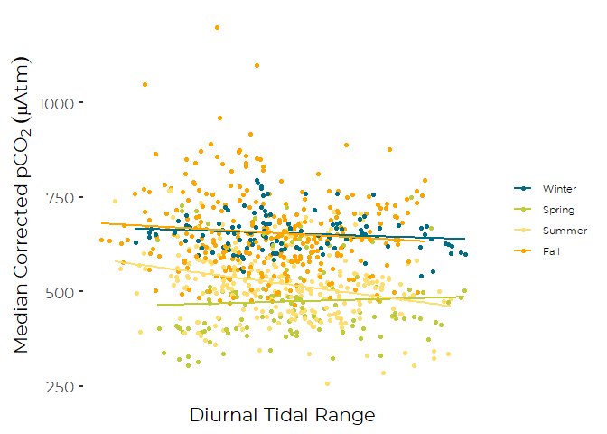<!-- -->

### An informal Look at Correlations

``` r
amplitude_data %>% select(range, co2_corr, Season) %>%
  group_by(Season) %>%
  summarize(correl_coef= threecors(range, co2_corr )) %>%
  ungroup() %>%
  mutate(Type = rep(c('Pearson', 'Spearman', 'Kendall'),4)) %>%
  select(Season, Type, correl_coef)
```

    ## `summarise()` has grouped output by 'Season'. You can override using the `.groups` argument.

    ## # A tibble: 12 x 3
    ##    Season Type     correl_coef
    ##    <fct>  <chr>          <dbl>
    ##  1 Winter Pearson      -0.130 
    ##  2 Winter Spearman     -0.0766
    ##  3 Winter Kendall      -0.0538
    ##  4 Spring Pearson       0.0535
    ##  5 Spring Spearman      0.118 
    ##  6 Spring Kendall       0.0642
    ##  7 Summer Pearson      -0.276 
    ##  8 Summer Spearman     -0.269 
    ##  9 Summer Kendall      -0.175 
    ## 10 Fall   Pearson      -0.0939
    ## 11 Fall   Spearman     -0.0771
    ## 12 Fall   Kendall      -0.0477

These are fairly low correlations. The only ones that look meaningfully
(as opposed to significantly) correlated are for summer…

### Formal Analysis

``` r
the_lm <- lm(co2_corr ~ range*Season,
               data = amplitude_data, na.action = na.exclude )
the_gls <- gls(co2_corr ~ range*Season, correlation = corAR1(form = ~ d),
               data = amplitude_data, na.action = na.exclude )
the_gls_2 <- gls(co2_corr ~ range:Season, correlation = corAR1(form = ~ d),
                 data = amplitude_data, na.action = na.exclude )
```

Using the autocorrelation functions by date dramatically slows execution
of the GLS models, compared with using simple sequential
autocorrelation, with only minimal changes in results.

``` r
summary(the_lm)
```

    ## 
    ## Call:
    ## lm(formula = co2_corr ~ range * Season, data = amplitude_data, 
    ##     na.action = na.exclude)
    ## 
    ## Residuals:
    ##     Min      1Q  Median      3Q     Max 
    ## -248.24  -58.83   -8.20   43.26  536.16 
    ## 
    ## Coefficients:
    ##                    Estimate Std. Error t value Pr(>|t|)    
    ## (Intercept)         693.314     52.318  13.252  < 2e-16 ***
    ## range                -3.833      5.052  -0.759 0.448293    
    ## SeasonSpring       -252.235     74.050  -3.406 0.000692 ***
    ## SeasonSummer        -10.165     65.110  -0.156 0.875983    
    ## SeasonFall           27.896     62.909   0.443 0.657571    
    ## range:SeasonSpring    7.032      7.152   0.983 0.325781    
    ## range:SeasonSummer  -12.209      6.311  -1.934 0.053430 .  
    ## range:SeasonFall     -2.806      6.167  -0.455 0.649219    
    ## ---
    ## Signif. codes:  0 '***' 0.001 '**' 0.01 '*' 0.05 '.' 0.1 ' ' 1
    ## 
    ## Residual standard error: 93.44 on 787 degrees of freedom
    ##   (201 observations deleted due to missingness)
    ## Multiple R-squared:  0.414,  Adjusted R-squared:  0.4088 
    ## F-statistic: 79.43 on 7 and 787 DF,  p-value: < 2.2e-16

This suggests we need to look at the pattern seasonally. Summer is
judged nearly statistically significantly different from Winter, which
here is the reference level of Season. Following good practice, that
suggests we should not try to interpret the main effect, but look
instead to the seasonal effects.

However, this model does not take into account the autocorrelation
between observations, so it is likely to overstate statistical
significance. So we compare results of a generalized least squares
model.

``` r
summary(the_gls)
```

    ## Generalized least squares fit by REML
    ##   Model: co2_corr ~ range * Season 
    ##   Data: amplitude_data 
    ##        AIC     BIC    logLik
    ##   7758.068 7804.75 -3869.034
    ## 
    ## Correlation Structure: ARMA(1,0)
    ##  Formula: ~d 
    ##  Parameter estimate(s):
    ##      Phi1 
    ## 0.9654641 
    ## 
    ## Coefficients:
    ##                        Value Std.Error   t-value p-value
    ## (Intercept)         618.7134  51.06113 12.117111  0.0000
    ## range                -3.1782   3.61594 -0.878955  0.3797
    ## SeasonSpring       -106.6885  69.37815 -1.537782  0.1245
    ## SeasonSummer        -36.2389  54.53175 -0.664548  0.5065
    ## SeasonFall          -11.2781  49.97036 -0.225696  0.8215
    ## range:SeasonSpring    6.7668   5.67404  1.192583  0.2334
    ## range:SeasonSummer    0.4283   4.67167  0.091675  0.9270
    ## range:SeasonFall      0.2765   4.39277  0.062944  0.9498
    ## 
    ##  Correlation: 
    ##                    (Intr) range  SsnSpr SsnSmm SsnFll rng:SsnSp rng:SsnSm
    ## range              -0.757                                                
    ## SeasonSpring       -0.552  0.558                                         
    ## SeasonSummer       -0.672  0.717  0.561                                  
    ## SeasonFall         -0.695  0.766  0.524  0.693                           
    ## range:SeasonSpring  0.508 -0.609 -0.938 -0.504 -0.505                    
    ## range:SeasonSummer  0.586 -0.775 -0.442 -0.901 -0.628  0.479             
    ## range:SeasonFall    0.623 -0.824 -0.453 -0.615 -0.915  0.499     0.679   
    ## 
    ## Standardized residuals:
    ##        Min         Q1        Med         Q3        Max 
    ## -2.3827752 -0.4744586  0.1308370  0.6827971  4.9945154 
    ## 
    ## Residual standard error: 123.6597 
    ## Degrees of freedom: 795 total; 787 residual

This analysis, which includes consideration of the high autocorrelation
between successive observations, suggests that the regressions lines are
not significantly different between seasons, and the main effects of
range is not statistically significant. That suggests there is nothing
here to see.

``` r
summary(the_gls_2)
```

    ## Generalized least squares fit by REML
    ##   Model: co2_corr ~ range:Season 
    ##   Data: amplitude_data 
    ##        AIC      BIC    logLik
    ##   7783.569 7816.273 -3884.784
    ## 
    ## Correlation Structure: ARMA(1,0)
    ##  Formula: ~d 
    ##  Parameter estimate(s):
    ##      Phi1 
    ## 0.9682987 
    ## 
    ## Coefficients:
    ##                       Value Std.Error   t-value p-value
    ## (Intercept)        588.7351  35.36838 16.645801  0.0000
    ## range:SeasonWinter  -1.3346   2.09211 -0.637941  0.5237
    ## range:SeasonSpring  -2.5223   2.14914 -1.173617  0.2409
    ## range:SeasonSummer  -3.0392   1.93810 -1.568144  0.1172
    ## range:SeasonFall    -1.7356   1.81677 -0.955296  0.3397
    ## 
    ##  Correlation: 
    ##                    (Intr) rng:SW rng:SsnSp rng:SsnSm
    ## range:SeasonWinter -0.353                           
    ## range:SeasonSpring -0.374  0.578                    
    ## range:SeasonSummer -0.412  0.511  0.616             
    ## range:SeasonFall   -0.413  0.598  0.519     0.689   
    ## 
    ## Standardized residuals:
    ##        Min         Q1        Med         Q3        Max 
    ## -2.3089350 -0.5082591  0.1688738  0.7187044  4.8568386 
    ## 
    ## Residual standard error: 128.9396 
    ## Degrees of freedom: 795 total; 790 residual

So, fitting four separate slopes, we also don’t see statistically
significant relationships with tidal range. The evidence is weak for an
important effect of tidal amplitude on pCO<sub>2</sub> at any season.

There is a question whether removing the autocorrelation from the
response, without also addressing the autocorrelation in the predictor
variable is appropriate. Since the predictor variable is itself highly
autocorrelated, the response will be too. This may be imposing too
strict a test.

The next step might be to fit a more complex model, which incorporates
more (time varying, autocorrelated) predictor variables, thus removing
more unexplained variation, and potentially generating a more sensitive
test.

We explored several alternate GAMMs, fitting either linear or nonlinear
smooth terms for the three added predictor variables. Results (for our
purposes here) did not differ materially. In all cases, the effect of
tidal range on pCO<sub>2</sub> remains statistically unimportant.

``` r
system.time(
the_gamm  <- gamm(co2_corr ~ range*Season + s(temp) + s(sal) + s(do), 
                  correlation = corAR1(form = ~ d),
               data = amplitude_data, na.action = na.exclude )
)
```

    ##    user  system elapsed 
    ##   87.98    0.78   88.78

``` r
summary(the_gamm$gam)
```

    ## Warning in as.numeric(object$y) - object$fitted.values: longer object length is
    ## not a multiple of shorter object length

    ## Warning in w * (as.numeric(object$y) - object$fitted.values): longer object
    ## length is not a multiple of shorter object length

    ## 
    ## Family: gaussian 
    ## Link function: identity 
    ## 
    ## Formula:
    ## co2_corr ~ range * Season + s(temp) + s(sal) + s(do)
    ## 
    ## Parametric coefficients:
    ##                    Estimate Std. Error t value Pr(>|t|)    
    ## (Intercept)        638.8674    47.4681  13.459   <2e-16 ***
    ## range               -3.6548     3.7904  -0.964    0.335    
    ## SeasonSpring       -69.4494    70.5616  -0.984    0.325    
    ## SeasonSummer        -0.2133    57.2005  -0.004    0.997    
    ## SeasonFall           7.8222    51.6626   0.151    0.880    
    ## range:SeasonSpring   5.6575     5.8241   0.971    0.332    
    ## range:SeasonSummer  -1.5007     4.9809  -0.301    0.763    
    ## range:SeasonFall    -0.9535     4.6004  -0.207    0.836    
    ## ---
    ## Signif. codes:  0 '***' 0.001 '**' 0.01 '*' 0.05 '.' 0.1 ' ' 1
    ## 
    ## Approximate significance of smooth terms:
    ##           edf Ref.df      F p-value    
    ## s(temp) 1.000  1.000  9.633   0.002 ** 
    ## s(sal)  4.817  4.817  9.102  <2e-16 ***
    ## s(do)   3.258  3.258 15.780  <2e-16 ***
    ## ---
    ## Signif. codes:  0 '***' 0.001 '**' 0.01 '*' 0.05 '.' 0.1 ' ' 1
    ## 
    ## R-sq.(adj) =     NA   
    ##   Scale est. = 9092.7    n = 656

So, that changes little. Although we see statistically significant
relationships with all three predictor variables, we see no evidence for
a significant relationship between daily tidal amplitudes and daily
median pCO<sub>2</sub>.

Lets see what shape those relationships show.

``` r
plot(the_gamm$gam)
```

<!-- --><!-- --><!-- -->

## pH vs Tidal Amplitude

### Graphic

``` r
ggplot(amplitude_data, aes(range, ph)) +
  geom_point(aes(color = Season)) +
  geom_smooth(mapping =aes(color = Season), method = 'lm', se = FALSE) +


  theme(legend.key.width = unit(0.25,"in"),
        legend.text      = element_text(size = 8)) +
  
  scale_x_continuous(breaks = c(0, 180, 360, 540, 720),
                     labels = c(0, 3, 6, 9, 12)) +
  
  scale_color_manual(values = season_palette, name = '') +
  
  xlab('Diurnal Tidal Range') +
  ylab('pH')
```

    ## `geom_smooth()` using formula 'y ~ x'

    ## Warning: Removed 451 rows containing non-finite values (stat_smooth).

    ## Warning: Removed 451 rows containing missing values (geom_point).

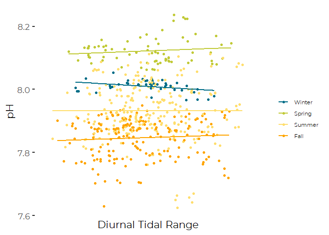<!-- -->

### An informal Look at Correlations

``` r
amplitude_data %>% select(range, ph, Season) %>%
  group_by(Season) %>%
  summarize(correl_coef= threecors(range, ph )) %>%
  ungroup() %>%
  mutate(Type = rep(c('Pearson', 'Spearman', 'Kendall'),4)) %>%
  select(Season, Type, correl_coef)
```

    ## `summarise()` has grouped output by 'Season'. You can override using the `.groups` argument.

    ## # A tibble: 12 x 3
    ##    Season Type     correl_coef
    ##    <fct>  <chr>          <dbl>
    ##  1 Winter Pearson     -0.351  
    ##  2 Winter Spearman    -0.302  
    ##  3 Winter Kendall     -0.220  
    ##  4 Spring Pearson      0.122  
    ##  5 Spring Spearman     0.0263 
    ##  6 Spring Kendall      0.00951
    ##  7 Summer Pearson      0.00211
    ##  8 Summer Spearman     0.00911
    ##  9 Summer Kendall      0.00616
    ## 10 Fall   Pearson      0.0688 
    ## 11 Fall   Spearman     0.0884 
    ## 12 Fall   Kendall      0.0568

These are fairly low correlations. The only ones that look meaningfully
(as opposed to significantly) correlated are for winter….

### Formal Analysis

``` r
the_lm <- lm(ph ~ range*Season,
               data = amplitude_data, na.action = na.exclude )
the_gls <- gls(ph ~ range*Season, correlation = corAR1(form = ~ d),
               data = amplitude_data, na.action = na.exclude )
```

``` r
summary(the_lm)
```

    ## 
    ## Call:
    ## lm(formula = ph ~ range * Season, data = amplitude_data, na.action = na.exclude)
    ## 
    ## Residuals:
    ##       Min        1Q    Median        3Q       Max 
    ## -0.306718 -0.041297  0.003229  0.044941  0.180514 
    ## 
    ## Coefficients:
    ##                     Estimate Std. Error t value Pr(>|t|)    
    ## (Intercept)         8.059085   0.080720  99.839   <2e-16 ***
    ## range              -0.004935   0.007952  -0.621   0.5351    
    ## SeasonSpring        0.030925   0.096778   0.320   0.7494    
    ## SeasonSummer       -0.128114   0.086168  -1.487   0.1377    
    ## SeasonFall         -0.238579   0.087164  -2.737   0.0064 ** 
    ## range:SeasonSpring  0.008094   0.009509   0.851   0.3950    
    ## range:SeasonSummer  0.005055   0.008477   0.596   0.5512    
    ## range:SeasonFall    0.007587   0.008619   0.880   0.3791    
    ## ---
    ## Signif. codes:  0 '***' 0.001 '**' 0.01 '*' 0.05 '.' 0.1 ' ' 1
    ## 
    ## Residual standard error: 0.0701 on 537 degrees of freedom
    ##   (451 observations deleted due to missingness)
    ## Multiple R-squared:  0.6157, Adjusted R-squared:  0.6107 
    ## F-statistic: 122.9 on 7 and 537 DF,  p-value: < 2.2e-16

There is no evidence here that tidal amplitude plays a role in pH,
despite the moderately high correlation in winter. This is probably
because the sample size in winter is quite small.

``` r
summary(the_gls)
```

    ## Generalized least squares fit by REML
    ##   Model: ph ~ range * Season 
    ##   Data: amplitude_data 
    ##         AIC       BIC   logLik
    ##   -2171.755 -2128.895 1095.877
    ## 
    ## Correlation Structure: ARMA(1,0)
    ##  Formula: ~d 
    ##  Parameter estimate(s):
    ##      Phi1 
    ## 0.9553233 
    ## 
    ## Coefficients:
    ##                        Value  Std.Error  t-value p-value
    ## (Intercept)         8.052870 0.08819095 91.31174  0.0000
    ## range              -0.003129 0.00595178 -0.52576  0.5993
    ## SeasonSpring       -0.090969 0.10936059 -0.83183  0.4059
    ## SeasonSummer       -0.075719 0.09595898 -0.78908  0.4304
    ## SeasonFall         -0.132984 0.09692698 -1.37201  0.1706
    ## range:SeasonSpring  0.005715 0.00839794  0.68050  0.4965
    ## range:SeasonSummer -0.000592 0.00671001 -0.08824  0.9297
    ## range:SeasonFall    0.001386 0.00679171  0.20402  0.8384
    ## 
    ##  Correlation: 
    ##                    (Intr) range  SsnSpr SsnSmm SsnFll rng:SsnSp rng:SsnSm
    ## range              -0.645                                                
    ## SeasonSpring       -0.789  0.519                                         
    ## SeasonSummer       -0.899  0.591  0.783                                  
    ## SeasonFall         -0.885  0.585  0.741  0.844                           
    ## range:SeasonSpring  0.456 -0.709 -0.747 -0.426 -0.417                    
    ## range:SeasonSummer  0.575 -0.887 -0.469 -0.679 -0.516  0.632             
    ## range:SeasonFall    0.582 -0.878 -0.465 -0.530 -0.695  0.622     0.780   
    ## 
    ## Standardized residuals:
    ##        Min         Q1        Med         Q3        Max 
    ## -3.0045324 -0.5539050 -0.1470756  0.5450041  2.3874074 
    ## 
    ## Residual standard error: 0.1031195 
    ## Degrees of freedom: 545 total; 537 residual

This analysis, which includes consideration of the high autocorrelation
between successive observations, suggests that the regressions lines are
not significantly different between seasons.

We fit a more complex model, which incorporates more (time varying,
autocorrelated) predictor variables, thus removing more unexplained
variation, and potentially generating a more sensitive test.

``` r
system.time(
the_gamm  <- gamm(ph ~ range*Season + s(temp) + s(sal) + s(do), correlation = corAR1(form = ~ d),
               data = amplitude_data, na.action = na.exclude )
)
```

    ##    user  system elapsed 
    ##   17.48    0.14   17.63

``` r
summary(the_gamm$gam)
```

    ## Warning in as.numeric(object$y) - object$fitted.values: longer object length is
    ## not a multiple of shorter object length

    ## Warning in w * (as.numeric(object$y) - object$fitted.values): longer object
    ## length is not a multiple of shorter object length

    ## 
    ## Family: gaussian 
    ## Link function: identity 
    ## 
    ## Formula:
    ## ph ~ range * Season + s(temp) + s(sal) + s(do)
    ## 
    ## Parametric coefficients:
    ##                      Estimate Std. Error t value Pr(>|t|)    
    ## (Intercept)         7.9718172  0.0651378 122.384   <2e-16 ***
    ## range               0.0003318  0.0061894   0.054    0.957    
    ## SeasonSummer        0.0613480  0.0770214   0.797    0.426    
    ## SeasonFall         -0.0531933  0.0775715  -0.686    0.493    
    ## range:SeasonSummer -0.0082673  0.0074883  -1.104    0.270    
    ## range:SeasonFall   -0.0024006  0.0072230  -0.332    0.740    
    ## ---
    ## Signif. codes:  0 '***' 0.001 '**' 0.01 '*' 0.05 '.' 0.1 ' ' 1
    ## 
    ## Approximate significance of smooth terms:
    ##           edf Ref.df      F  p-value    
    ## s(temp) 1.000  1.000 11.205 0.000903 ***
    ## s(sal)  1.000  1.000  0.196 0.657923    
    ## s(do)   4.175  4.175  8.440 1.59e-06 ***
    ## ---
    ## Signif. codes:  0 '***' 0.001 '**' 0.01 '*' 0.05 '.' 0.1 ' ' 1
    ## 
    ## R-sq.(adj) =     NA   
    ##   Scale est. = 0.0042668  n = 366

So, that changes little. Again, we see little evidence for a significant
relationship between daily tidal amplitudes and daily median pH.

``` r
plot(the_gamm$gam)
```

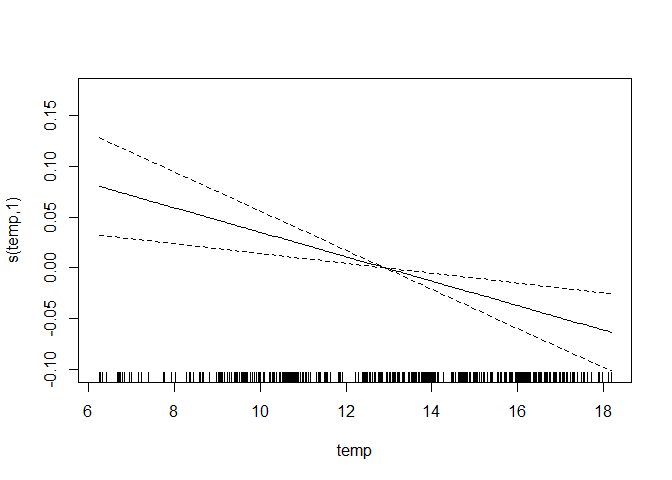<!-- -->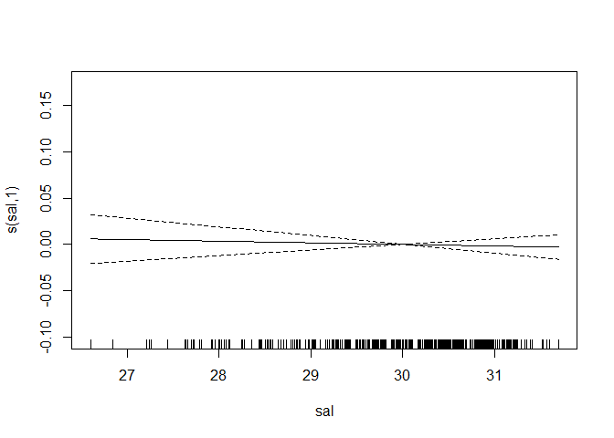<!-- -->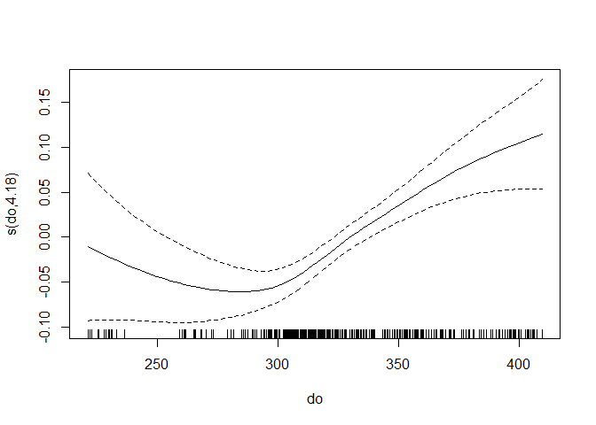<!-- -->

## Direct Comparison Graphics For 2016

You can not visualize these relationships if you look at four years of
data – the graphics are simply too compressed, so we zoom in one one
period – summer and fall of 2016.

### Using Daily Medians

``` r
tmp <- amplitude_data %>%
   mutate(mm = as.numeric(format(d, format = '%m'))) %>%
   filter(yyyy == 2016) %>%
   filter(mm > 7 & mm <= 12)

plt <- tmp %>%
  ggplot(aes(x=d, y=co2_corr)) +
  geom_line() +
  geom_line(aes(d,range*75), data = tmp, color = 'red', lwd=1.5) +
  xlab('Date') +
  ylab(expression(paste("pCO"[2],'(', mu,"Atm)"))) +
  scale_y_continuous(sec.axis = sec_axis(~ ./75, name = 'Tidal Amplitude (ft)'))
plt
```

<!-- -->

``` r
rm(tmp)
```

### Using All Observations

``` r
tmp <- amplitude_data %>%
   mutate(mm    = as.numeric(format(d, format = '%m'))) %>%
   filter(yyyy == 2016) %>%
   filter(mm>7 & mm<=12)


plt <- tidal_data %>%
  filter(yyyy== 2016) %>%
  filter(mm > 7 & mm<12) %>%
  
  ggplot(aes(x=stdtime, y=co2_corr)) +
  geom_point(color = cbep_colors()[5], alpha = 0.2) +
  
  xlab('Date (2016)') +
 
  theme_minimal() +
  theme(axis.title = element_text(size = 16)) +
  theme(axis.text.y = element_text(size = 10)) +
  theme(axis.text.x = element_text(size = 10)) +
  theme(legend.title = element_blank()) 
```

``` r
tm <- as.POSIXct(tmp$d)

plt +  
  geom_smooth(method = 'loess', span = 0.075, se = FALSE) +
  geom_line(aes(tm ,range*75), data = tmp, color = 'red', lwd=1.5) +
  scale_y_continuous(name = expression(paste("Corrected pCO"[2],'(', mu,"Atm)")),
                     sec.axis = sec_axis(~ ./75, 
                                         name = 'Daily Tidal Amplitude (ft)'))
```

    ## `geom_smooth()` using formula 'y ~ x'

    ## Warning: Removed 26 rows containing non-finite values (stat_smooth).

    ## Warning: Removed 26 rows containing missing values (geom_point).

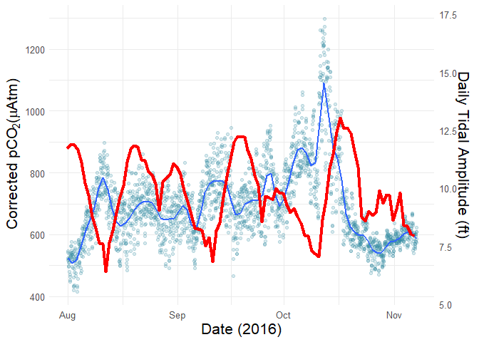<!-- -->
