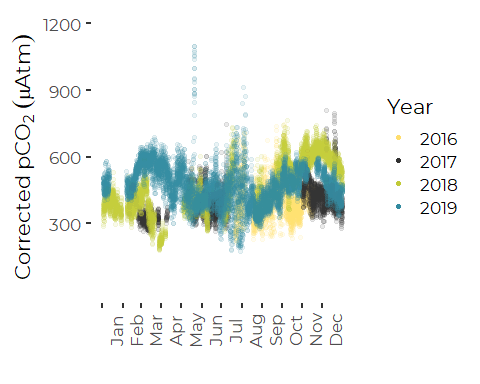
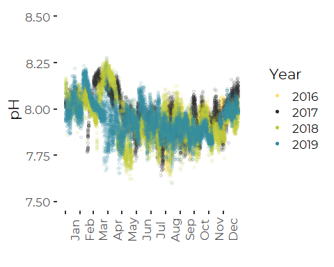
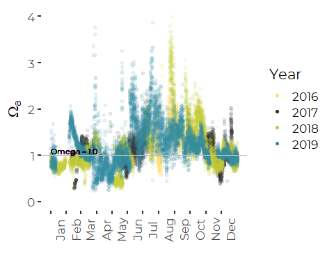

Analysis of OA Data From FOCB – Revised Graphics
================
Curtis C. Bohlen, Casco Bay Estuary Partnership
7/15/2020

-   [Establish Color Palettes](#establish-color-palettes)
-   [Load Data](#load-data)
    -   [Establish Folder Reference](#establish-folder-reference)
    -   [Load The Data](#load-the-data)
        -   [Primary Data](#primary-data)
        -   [CO2SYS Results](#co2sys-results)
        -   [Merge pH (Total Scale) data into primary
            data](#merge-ph-total-scale-data-into-primary-data)
        -   [Add A Variable for the
            Season](#add-a-variable-for-the-season)
    -   [Takehashi et al. 2002
        Relationships](#takehashi-et-al-2002-relationships)
        -   [Calculations](#calculations)
-   [Base Graphics](#base-graphics)
    -   [Constants for Axis Labels](#constants-for-axis-labels)
    -   [Seasonal Profiles](#seasonal-profiles)
        -   [Temperature Corrected pCO2](#temperature-corrected-pco2-1)
        -   [pH (Total Scale)](#ph-total-scale)
        -   [Aragonite Saturation State](#aragonite-saturation-state)


``` r
library(tidyverse)
```

    ## Warning: package 'tidyverse' was built under R version 4.0.5

    ## -- Attaching packages --------------------------------------- tidyverse 1.3.1 --

    ## v ggplot2 3.3.5     v purrr   0.3.4
    ## v tibble  3.1.4     v dplyr   1.0.7
    ## v tidyr   1.1.3     v stringr 1.4.0
    ## v readr   2.0.1     v forcats 0.5.1

    ## Warning: package 'ggplot2' was built under R version 4.0.5

    ## Warning: package 'tibble' was built under R version 4.0.5

    ## Warning: package 'tidyr' was built under R version 4.0.5

    ## Warning: package 'readr' was built under R version 4.0.5

    ## Warning: package 'dplyr' was built under R version 4.0.5

    ## Warning: package 'forcats' was built under R version 4.0.5

    ## -- Conflicts ------------------------------------------ tidyverse_conflicts() --
    ## x dplyr::filter() masks stats::filter()
    ## x dplyr::lag()    masks stats::lag()

``` r
library(readxl)
library(mgcv)
```

    ## Loading required package: nlme

    ## 
    ## Attaching package: 'nlme'

    ## The following object is masked from 'package:dplyr':
    ## 
    ##     collapse

    ## This is mgcv 1.8-36. For overview type 'help("mgcv-package")'.

``` r
#library(GGally)
#library(zoo)
library(lubridate)  # here, for the make_datetime() function
```

    ## Warning: package 'lubridate' was built under R version 4.0.5

    ## 
    ## Attaching package: 'lubridate'

    ## The following objects are masked from 'package:base':
    ## 
    ##     date, intersect, setdiff, union

``` r
library(CBEPgraphics)
load_cbep_fonts()
theme_set(theme_cbep())
```

# Establish Color Palettes

Four seasons

``` r
seasonal_colors <- c(cbep_colors()[c(1, 4, 2)], 'orange')
```

The following is used to “synchronize” colors with graphics from
CBEP/UNH acidification monitoring.

``` r
year_colors = cbep_colors()[c(2:6,1)]
```

# Load Data

## Establish Folder Reference

``` r
sibfldnm <- 'Original_Data'
parent   <- dirname(getwd())
sibling  <- 'C:\\Users\\curtis.bohlen\\Documents\\State of the Bay 2020\\Data\\B13. Ocean and Coastal Acidification\\FOCB_OA\\Original_Data'

fn    <- 'CMS1 Data through 2019.xlsx'
fpath <- file.path(sibling,fn)

dir.create(file.path(getwd(), 'extra_figures'), showWarnings = FALSE)
```

## Load The Data

We need to skip the second row here, which is inconvenient largely
because the default “guess” of data contents for each column is based on
the contents of that first row of data.

A solution in an answer to this stack overflow questions
(<https://stackoverflow.com/questions/51673418/how-to-skip-the-second-row-using-readxl>)
suggests reading in the first row only to generate names, then skip the
row of names and the row of units, and read the “REAL” data. Note that I
round the timestamp on the data to the nearest hour.

In earlier work, we found some inconsistencies in how daylight savings
time was dealt with here, but there is no easy way to correct for those
inconsistencies. It appears that FOCB deployed their loggers based on
local time, and deployments that extended across transitions to or from
Daylight Savings Time therefore may have incorrect time stamps (off by
an hour) for periods of days to weeks. This really only matters when
looking at effect of time of day or time of tide on FOCB results.

For some reason, read\_excel is not reading in the dates and times
correctly. WE reconstruct the time from components. As described above,
the timezone settings for this are not 100% certain. here I read the
data in with local time, which I believe is usually correct for FOCB’s
data.

### Primary Data

``` r
mynames <- read_excel(fpath, sheet = 'Sheet1', n_max = 1, col_names = FALSE)
```

    ## New names:
    ## * `` -> ...1
    ## * `` -> ...2
    ## * `` -> ...3
    ## * `` -> ...4
    ## * `` -> ...5
    ## * ...

``` r
mynames <- unname(unlist(mynames[1,]))  # flatten and simplify
mynames[2] <- 'datetime'               # 
mynames[4] <- 'depth'                   # Address non-standard names
mynames[8] <- 'pctsat'
mynames[18] <- 'omega_a'
mynames <- tolower(mynames)             # convert all to lower case

the_data <- read_excel(fpath, skip=2, col_names = FALSE)
```

    ## New names:
    ## * `` -> ...1
    ## * `` -> ...2
    ## * `` -> ...3
    ## * `` -> ...4
    ## * `` -> ...5
    ## * ...

``` r
names(the_data) <- mynames
rm(mynames)
```

``` r
the_data <- the_data %>%
  select(-count, -time, -datetime)  %>%       # datetime and time contain the same data
  mutate(dt = make_datetime(year, month, day, hour, 0, tz = "America/New_York")) %>%
  rename(datetime = dt) %>%
  mutate(thedate  = as.Date(datetime),
         doy      = as.numeric(format(datetime, format = '%j')),
         tstamp   = paste0(year, '/', sprintf("%02d", month), '/',
                           sprintf("%02d", day), ' ', sprintf("%02d", hour)),
         Month = factor(month, labels = month.abb)) %>%
  arrange(datetime)                # Confirm that data are in chronological order
```

### CO2SYS Results

We ran CO2SYS in Python, principally to calculate estimated pH under the
total pH scale. Here we load it and use a left join by timestamp to add
the data to the principal data set.

``` r
sibfldnm <- 'PyCO2SYS_Calc'
parent   <- dirname(getwd())
sibling  <- 'C:\\Users\\curtis.bohlen\\Documents\\State of the Bay 2020\\Data\\B13. Ocean and Coastal Acidification\\FOCB_OA\\PyCO2SYS_Calc'

fn    <- 'focbco2sys_out.csv'
fpath <- file.path(sibling,fn)


ph_tot_data <- read_csv(fpath, 
    col_types   = cols(month = col_integer(), 
        year    = col_integer(), 
        day     = col_integer(), 
        hour    = col_integer(), 
        temp    = col_number(), 
        sal     = col_number(), 
        pco2    = col_number(), 
        ph      = col_number(), 
        omega_a = col_number(), 
        omega_c = col_number(), 
        ta      = col_number(), 
        dic     = col_number(),
        ph_tot  = col_number())) %>%
  mutate(tstamp = paste0(year, '/', sprintf("%02d", month), '/',
                         sprintf("%02d", day), ' ', sprintf("%02d", hour))) %>%
  select(ph_tot, tstamp)
```

### Merge pH (Total Scale) data into primary data

Note this assumes there are no duplicate time stamps….

``` r
the_data <- the_data %>%
  left_join(ph_tot_data, by='tstamp') %>%
  select(-tstamp)
rm(ph_tot_data)
```

### Add A Variable for the Season

``` r
the_data <- the_data %>%
  mutate(Season = recode_factor(month,
                                `1`  = 'Winter',
                                `2`  = 'Winter',
                                `3`  = 'Spring',
                                `4`  = 'Spring',
                                `5`  = 'Spring',
                                `6`  = 'Summer',
                                `7`  = 'Summer',
                                `8`  = 'Summer',
                                `9`  = 'Fall',
                                `10` = 'Fall',
                                `11` = 'Fall',
                                `12` = 'winter'))
```

## Takehashi et al. 2002 Relationships

Here we follow a formula for calculating a “Temperature Corrected”
pCO<sub>2</sub>, which is derived from methods in Takehashi et al. 2002.
The “temperature corrected” version adjusts for the thermodynamic effect
of temperature on pCO<sub>2</sub>.

> Takahashi, Taro & Sutherland, Stewart & Sweeney, Colm & Poisson, Alain
> & Metzl, Nicolas & Tilbrook, Bronte & Bates, Nicholas & Wanninkhof,
> Rik & Feely, Richard & Chris, Sabine & Olafsson, Jon & Nojiri,
> Yukihiro. (2002). Global sea-air CO2 flux based on climatological
> surface ocean pCO2, and seasonal biological and temperature effects.
> Deep Sea Research Part II: Topical Studies in Oceanography. 49.
> 1601-1622. 10.1016/S0967-0645(02)00003-6.

Takahashi et al. 2002 Used direct calculation of “temperature corrected”
pCO<sub>2</sub> as a surrogate for changes in CO<sub>2</sub>
concentration, and conversely, estimates of “expected” thermal
pCO<sub>2</sub>, as estimates of the magnitude of the fluctuations in
pCO<sub>2</sub> one would expect to see due to temperature alone, if
there were no changes in \[CO<sub>2</sub>\].

The Takehashi et al. 2002 equations are as follows:

#### “Expected pCO<sub>2</sub>” at Observed Temperature

(*p**C**O*<sub>2</sub> at *T*<sub>*o**b**s*</sub>) = (*p**C**O*<sub>2</sub>)<sub>*o**b**s*</sub> × *e**x**p*(0.0423(*T*<sub>*o**b**s*</sub> − *T*<sub>*m**e**a**n*</sub>)

#### “Temperature Corrected” pCO<sub>2</sub>

(*p**C**O*<sub>2</sub> at *T*<sub>*m**e**a**n*</sub>) = (*p**C**O*<sub>2</sub>)<sub>*o**b**s*</sub> × *e**x**p*(0.0423(*T*<sub>*m**e**a**n*</sub> − *T*<sub>*o**b**s*</sub>)

### Calculations

We calculate the “temperature corrected” time series as calculated in
Takehashi et al. “Temperature Corrected” pCO<sub>2</sub> value
(“co2\_corr”) provides a trace of changes in pCO<sub>2</sub> that “would
have happened” in the absence of temperature changes. These reflect
changes in the concentration of CO<sub>2</sub>, which reflect a
combination of biology and diffusion of CO<sub>2</sub> between ocean and
atmosphere and advection past the sensor by tides and currents. Here we
adjust pCO<sub>2</sub> to a “standard temperature” of 12 degrees C. This
is slightly warmer than the observed annual average temperature. We use
12 degrees C principlly for consistency with analysis of the CBEP / UNH
data.

``` r
t_ref = 12
the_data <- the_data %>%
  mutate(pco2_corr =  pco2*exp(0.0423*(t_ref-temperature)))# %>%
  #select(c(16, 17, 11, 10, 9, 19, 12,  18, 1:5, 7,  6, 20, 8, 21, 13:15))  # reorder for convenience
rm(t_ref)
```

# Base Graphics

## Constants for Axis Labels

``` r
monthlengths <-  c(31,28,31, 30,31,30,31,31,30,31,30,31)
cutpoints    <- c(0, cumsum(monthlengths)[1:12])[1:12]
```

## Seasonal Profiles

These graphs combine data from multiple years to generate a picture of
seasonal conditions across multiple years. Since data coverage is
inconsistent year to year, data for some times of year are derived from
just one or two years, which could bias the results.

### Temperature Corrected pCO2

It’s not technically OK to show a reference line on a figure with
temperature-corrected pCO2. The equilibrium between \[co<sub>2</sub>\]
and fugacity is temperature dependent.

``` r
plt <- ggplot(the_data, aes(doy, pco2_corr)) + geom_point(aes(color = factor(year)), alpha = 0.1) +
  
  # geom_hline(aes(yintercept = 400), lty = 'dotted', color = 'gray') +
  # annotate('text', x=365, y=370, label= expression(pCO[2*(cor)]~'='~ 400), hjust=1, size=3) +
  
  xlab('') +
  ylab(expression (Corrected~pCO[2]~(mu*Atm))) +
  scale_color_manual(values=year_colors, name='Year') +
  scale_x_continuous(breaks = cutpoints, labels = month.abb) +
  scale_y_continuous(breaks = c(300,600, 900, 1200), limits = c(0, 1200)) +
  guides(colour = guide_legend(override.aes = list(alpha = 1))) +
  theme_cbep() +
  theme(axis.text.x=element_text(angle=90, vjust = 1.5))
plt
```

    ## Warning: Removed 10799 rows containing missing values (geom_point).

<!-- -->

``` r
ggsave('extra_figures/extra_pco2Seasonal_focb.png', type = 'cairo', width = 5, height = 4)
```

    ## Warning: Removed 10799 rows containing missing values (geom_point).

``` r
#ggsave('extra_figures/extra_pco2Seasonal_focb.pdf', device=cairo_pdf, width = 5, height = 4)
```

This shows much less obvious seasonality than the CBEP / UNH site.

### pH (Total Scale)

``` r
plt <- ggplot(the_data, aes(doy, ph_tot)) + geom_point(aes(color = factor(year)),alpha = 0.1) +
  xlab('') +
  ylab('pH') +
  scale_color_manual(values=year_colors, name='Year') +
  scale_x_continuous(breaks = cutpoints, labels = month.abb) +

  scale_y_continuous(limits = c(7.5, 8.5), breaks = c(7.5, 7.75, 8.0, 8.25, 8.5)) +
  
  guides(colour = guide_legend(override.aes = list(alpha = 1))) +
  theme_cbep() +
  theme(axis.text.x=element_text(angle=90, vjust = 1.5))
plt
```

    ## Warning: One or more parsing issues, see `problems()` for details

    ## Warning: Removed 909 rows containing missing values (geom_point).

<!-- -->

``` r
ggsave('extra_figures/extra_phSeasonal_focb.png', type = 'cairo', width = 5, height = 4)
```

    ## Warning: Removed 909 rows containing missing values (geom_point).

``` r
#ggsave('extra_figures/extra_phSeasonal_focb.pdf', device=cairo_pdf, width = 5, height = 4)
```

### Aragonite Saturation State

``` r
plt <- ggplot(the_data, aes(doy, omega_a)) + geom_point(aes(color = factor(year)), alpha = 0.1) +
  
  # geom_hline(aes(yintercept = 1.5), lty = 'solid', color = 'gray') +
  # geom_text(aes(x=0, y=1.4, label= 'Omega = 1.5', hjust = 0), size=3) +
  
  geom_hline(aes(yintercept = 1), lty = 'solid', color = 'gray') +
  geom_text(aes(x=0, y=1.1, label= 'Omega = 1.0', hjust = 0), size=3) +
  
  
  xlab('') +
  ylab(expression(Omega[a])) +
  
  scale_color_manual(values=year_colors, name='Year') +
  scale_x_continuous(breaks = cutpoints, labels = month.abb) +
  scale_y_continuous( limits = c(0, 4)) +
  
  guides(colour = guide_legend(override.aes = list(alpha = 1))) +
  
  theme_cbep() +
  theme(axis.text.x=element_text(angle=90, vjust = 1.5))
  
plt
```

    ## Warning: Removed 10801 rows containing missing values (geom_point).

<!-- -->

``` r
ggsave('extra_figures/extra_omegaSeasonal_focb.png', type = 'cairo', width = 5, height = 4)
```

    ## Warning: Removed 10801 rows containing missing values (geom_point).

``` r
#ggsave('extra_figures/extra_omegaSeasonal_focb.pdf', device=cairo_pdf, width = 5, height = 4)
```
