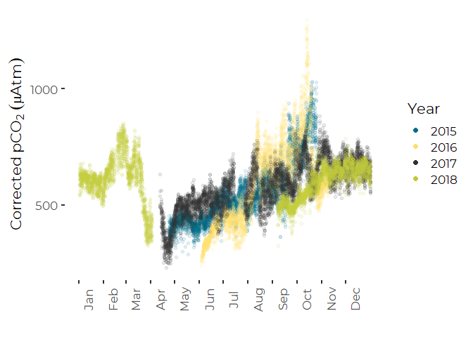
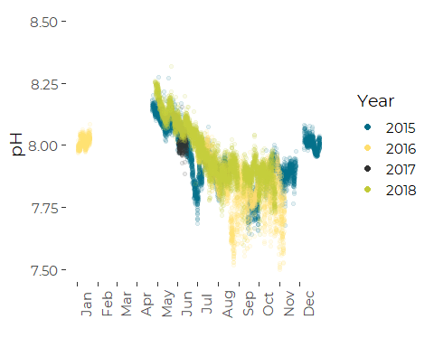
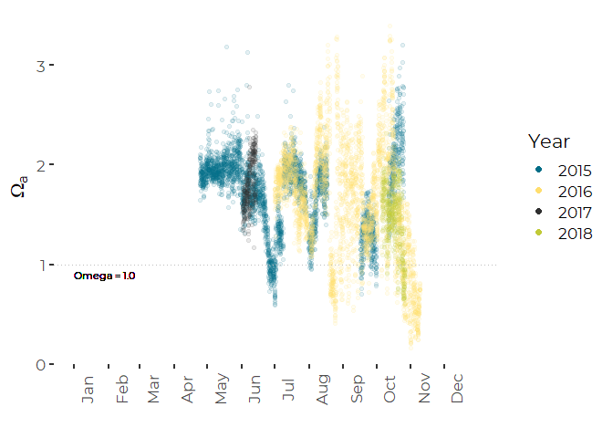
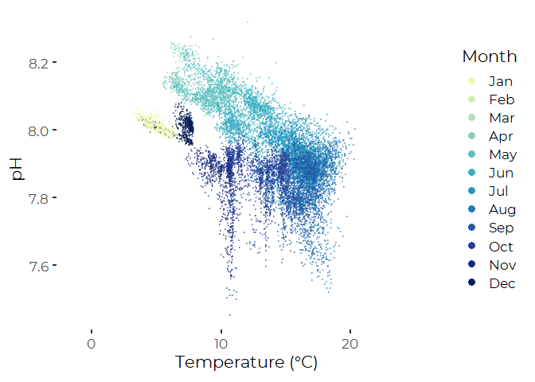
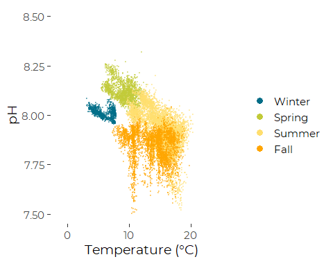
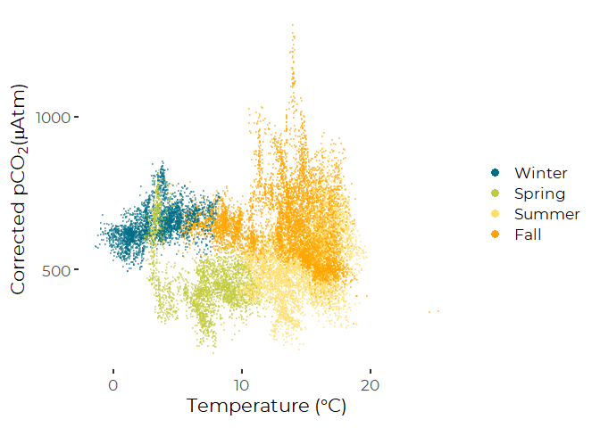

Analysis of Casco Bay OA data through 2018 – Revised Graphics
================
Curtis C. Bohlen, Casco Bay Estuary Partnership

  - [Introduction](#introduction)
  - [Load Libraries](#load-libraries)
  - [Generate Color Palettes](#generate-color-palettes)
      - [Monthly](#monthly)
      - [Seasonal](#seasonal)
  - [Constants for Axis Labels](#constants-for-axis-labels)
  - [Load Data](#load-data)
      - [Establish Folder References](#establish-folder-references)
      - [Read Data](#read-data)
  - [Seasonal Profiles](#seasonal-profiles)
      - [Temperature Corrected
        pCO<sub>2</sub>](#temperature-corrected-pco2)
      - [pH](#ph)
      - [Aragonite Saturation State](#aragonite-saturation-state)
  - [PH by Temperature](#ph-by-temperature)
      - [Monthly](#monthly-1)
      - [Seasonal](#seasonal-1)
  - [pCO<sub>2</sub> by Temperature](#pco2-by-temperature)
      - [Seasonal](#seasonal-2)


# Introduction

This notebook and related notebooks document exploratory data analysis
of data derived from a multi-year deployment of ocean acidification
monitoring equipment at the Southern Maine Community College pier, in
South Portland.

The monitoring set up was designed and operated by Joe Kelly, of UNH and
his colleagues, on behalf of the Casco Bay Estuary Partnership. This was
one of the first long-term OA monitoring facilities in the northeast,
and was intended to test available technologies as well as gain
operational experience working with acidification monitoring.

In this Notebook, we develop revised versions of the primary graphics
used to examine acidification in Casco Bay Estuary partnership’s 2020
State of the Bay report, along with related graphics that wqe did not
end up using in the report.

# Load Libraries

``` r
library(tidyverse)
```

    ## -- Attaching packages ---------------------------------------------------------------------- tidyverse 1.3.0 --

    ## v ggplot2 3.3.2     v purrr   0.3.4
    ## v tibble  3.0.3     v dplyr   1.0.2
    ## v tidyr   1.1.2     v stringr 1.4.0
    ## v readr   1.3.1     v forcats 0.5.0

    ## -- Conflicts ------------------------------------------------------------------------- tidyverse_conflicts() --
    ## x dplyr::filter() masks stats::filter()
    ## x dplyr::lag()    masks stats::lag()

``` r
library(lubridate)
```

    ## 
    ## Attaching package: 'lubridate'

    ## The following objects are masked from 'package:base':
    ## 
    ##     date, intersect, setdiff, union

``` r
library(CBEPgraphics)
load_cbep_fonts()

library(RColorBrewer)
#display.brewer.all(n=9, type="seq", exact.n=TRUE, colorblindFriendly = TRUE)
```

# Generate Color Palettes

## Monthly

To display data by months in complex graphics, we want a 12 item
sequential color palette that’s color-blind and reproduction friendly.

The rColorBrewer colorRampPalette() function creates a FUNCTION that
takes the number of colors, and returns a suitable color ramp, based on
another (usually shorter) color ramp. Note getPalette is a FUNCTION.
We’ll use this function later to generate the colors we want on the
fly.

``` r
# generates a palette function from an existing color ramp
getPalette = colorRampPalette(brewer.pal(9, "YlGnBu")[2:9])  
```

## Seasonal

This is just a list, not a function like cbep\_colors().

``` r
season_palette = c(cbep_colors()[1],
                    cbep_colors()[4],
                    cbep_colors()[2],
                    'orange')
```

# Constants for Axis Labels

``` r
monthlengths <-  c(31,28,31, 30,31,30,31,31,30,31,30,31)
cutpoints    <- c(0, cumsum(monthlengths)[1:12])[1:12]
```

# Load Data

## Establish Folder References

``` r
sibfldnm <- 'Derived_Data'
parent   <- dirname(getwd())
sibling  <- file.path(parent,sibfldnm)

fn    <- 'CascoBayOAData.csv'
fpath <- file.path(sibling,fn)

dir.create(file.path(getwd(), 'figures'), showWarnings = FALSE)
```

The following loads existing data, including a “temperature corrected”
pCO<sub>2</sub> value based on Takehashi et al. 2002. It then collapses
that data to daily summaries.

> Takahashi, Taro & Sutherland, Stewart & Sweeney, Colm & Poisson, Alain
> & Metzl, Nicolas & Tilbrook, Bronte & Bates, Nicholas & Wanninkhof,
> Rik & Feely, Richard & Chris, Sabine & Olafsson, Jon & Nojiri,
> Yukihiro. (2002). Global sea-air CO2 flux based on climatological
> surface ocean pCO<sub>2</sub>, and seasonal biological and temperature
> effects. Deep Sea Research Part II: Topical Studies in Oceanography.
> 49. 1601-1622. 10.1016/S0967-0645(02)00003-6.

(See the “Data\_Review\_And\_Filtering” R Notebook for details on why
and how we calculated temperature-corrected pCO<sub>2</sub> values.)

## Read Data

Note this version adjusts dates and times for Eastern Standard Time. It
also assigns each observation to a season based on month of the year.

``` r
all_data <- read_csv(fpath,
                     col_types = cols(dd = col_integer(), 
                                      doy = col_integer(),
                                      hh = col_integer(),
                                      mm = col_integer(),
                                      yyyy = col_integer())) %>%
  select(c(datetime, temp, sal, do, ph, co2, co2_corr, omega_a)) %>%
  mutate(datetime = force_tz(datetime, tzone = 'UTC')) %>%
  
  # Calculate local standard time coordinates
  mutate(stdtime = structure(datetime, tzone = 'Etc/GMT+5')) %>%
  mutate(yyyy  = as.numeric(format(stdtime, format = '%Y')),
         mm    = as.numeric(format(stdtime, format = '%m')),
         dd    = as.numeric(format(stdtime, format = '%d')),
         doy   = as.numeric(format(stdtime, format = '%j')),
         hh    = as.numeric(format(stdtime, format = '%H')),
         Month = factor(mm, levels=1:12, labels = month.abb)
         ) %>%
  mutate(Season = recode_factor(mm, 
                                `1`  = 'Winter',
                                `2`  = 'Winter',
                                `3`  = 'Spring',
                                `4`  = 'Spring',
                                `5`  = 'Spring',
                                `6`  = 'Summer',
                                `7`  = 'Summer',
                                `8`  = 'Summer',
                                `9`  = 'Fall',
                                `10` = 'Fall',
                                `11` = 'Fall',
                                `12` = 'Winter'
                                ))
```

# Seasonal Profiles

Only two changes here compared to the draft graphics:

1.  The colors have been reordered to simplify making the colors
    correspond to the same years as in the FOCB graphics and
2.  The Y axis Legend has been simplified slightly.

## Temperature Corrected pCO<sub>2</sub>

``` r
plt <- ggplot(all_data, aes(doy, co2_corr)) +
  geom_point(aes(color = factor(yyyy)), alpha = 0.1) +
  
  xlab('') +
  ylab(expression (Corrected~pCO[2]~(mu*Atm))) +
  scale_color_manual(values=cbep_colors(), name='Year') +
  scale_x_continuous(breaks = cutpoints, labels = month.abb) +
  guides(colour = guide_legend(override.aes = list(alpha = 1, size = 2))) +
  theme_cbep() +
  theme(axis.text.x=element_text(angle=90, vjust = 1.5))
plt
```

    ## Warning: Removed 6157 rows containing missing values (geom_point).

<!-- -->

``` r
# ggsave('figures/pco2Seasonal_cbep_2.png', type = 'cairo', width = 7, height = 5)
ggsave('figures/pco2Seasonal_cbep_2.pdf', device=cairo_pdf, width = 7, height = 5)
```

    ## Warning: Removed 6157 rows containing missing values (geom_point).

## pH

``` r
plt <- ggplot(all_data, aes(doy, ph)) + geom_point(aes(color = factor(yyyy)),alpha = 0.1) +
  xlab('') +
  ylab('pH') +
  scale_color_manual(values=cbep_colors(), name='Year') +
  scale_x_continuous(breaks = cutpoints, labels = month.abb) +

  scale_y_continuous(limits = c(7.5, 8.5), breaks = c(7.5, 7.75, 8.0, 8.25, 8.5)) +
  
  guides(colour = guide_legend(override.aes = list(alpha = 1, size = 2))) +
  theme_cbep() +
  theme(axis.text.x=element_text(angle=90, vjust = 1.5))
plt
```

    ## Warning: Removed 11854 rows containing missing values (geom_point).

<!-- -->

``` r
# ggsave('figures/phSeasonal_cbep.png', type = 'cairo', width = 7, height = 5)
ggsave('figures/phSeasonal_cbep.pdf', device=cairo_pdf, width = 7, height = 5)
```

    ## Warning: Removed 11854 rows containing missing values (geom_point).

## Aragonite Saturation State

``` r
plt <- ggplot(all_data, aes(doy, omega_a)) +
  geom_point(aes(color = factor(yyyy)), alpha = 0.1) +
  
  # geom_hline(aes(yintercept = 1.5), lty = 'dotted', color = 'gray') +
  # geom_text(aes(x=0, y=1.4, label= 'Omega = 1.5', hjust = 0), size=3) +
  
  geom_hline(aes(yintercept = 1), lty = 'dotted', color = 'gray') +
  geom_text(aes(x=0, y=0.9, label= 'Omega = 1.0', hjust = 0), size=3) +
  
  
  xlab('') +
  ylab(expression(Omega[a])) +
  
  scale_color_manual(values=cbep_colors(), name='Year') +
  scale_x_continuous(breaks = cutpoints, labels = month.abb) +
  
  guides(colour = guide_legend(override.aes = list(alpha = 1, size = 2))) +
  
  theme_cbep() +
  theme(axis.text.x=element_text(angle=90, vjust = 1.5))
  
plt
```

    ## Warning: Removed 17567 rows containing missing values (geom_point).

<!-- -->

``` r
# ggsave('figures/omegaSeasonal_cbep.png', type = 'cairo', width = 7, height = 5)
ggsave('figures/omegaSeasonal_cbep.pdf', device=cairo_pdf, width = 7, height = 5)
```

    ## Warning: Removed 17567 rows containing missing values (geom_point).

# PH by Temperature

## Monthly

``` r
plt <- ggplot(all_data, aes(temp, ph)) + 
  geom_point(aes(color = factor(mm)), alpha = 0.4, size = 0.5) +
  scale_color_manual(values = getPalette(12), name = 'Month',
                     labels=month.abb) +

  xlab(expression(Temperature~'('*degree*C*')')) +
  ylab('pH') +

  guides(colour = guide_legend(override.aes = list(alpha = 1, size = 3))) +

  theme_cbep()
plt
```

    ## Warning: Removed 11917 rows containing missing values (geom_point).

<!-- -->

``` r
#ggsave('figures/phbytemp_monthly.png', type = 'cairo', width = 7, height = 5)
#ggsave('figures/phbytemp_monthly.pdf', device = cairo_pdf, width = 7, height = 5)
```

## Seasonal

``` r
plt <- ggplot(all_data, aes(temp, ph)) + 
  geom_point(aes(color = Season), alpha = 0.4, size = 0.5) +
  scale_color_manual(values = season_palette, name = '') +

  xlab(expression(Temperature~'('*degree*C*')')) +
  ylab('pH') +

  guides(colour = guide_legend(override.aes = list(alpha = 1, size = 3))) +

  theme_cbep()
plt
```

    ## Warning: Removed 11917 rows containing missing values (geom_point).

<!-- -->

``` r
# ggsave('figures/phbytemp_seasonal.png', type = 'cairo', width = 7, height = 5)
ggsave('figures/phbytemp_seasonal.pdf', device = cairo_pdf, width = 7, height = 5)
```

    ## Warning: Removed 11917 rows containing missing values (geom_point).

# pCO<sub>2</sub> by Temperature

## Seasonal

``` r
plt <- ggplot(all_data, aes(temp, co2_corr)) +
  geom_point(aes(color = Season), alpha = 0.4, size=0.5) +
  
  scale_color_manual(values = season_palette, name = '') +

  xlab(expression(Temperature~'('*degree*C*')')) +
  ylab(expression(paste("Corrected pCO"[2],'(', mu,"Atm)"))) +

  guides(colour = guide_legend(override.aes = list(alpha = 1, size = 3))) +

  theme_cbep()
  
plt
```

    ## Warning: Removed 6157 rows containing missing values (geom_point).

<!-- -->

``` r
# ggsave('figures/pco2bytemp_seasonal.png', type = 'cairo', width = 7, height = 5)
ggsave('figures/pco2bytemp_Seasonal.pdf', device = cairo_pdf, width = 7, height = 5)
```

    ## Warning: Removed 6157 rows containing missing values (geom_point).
